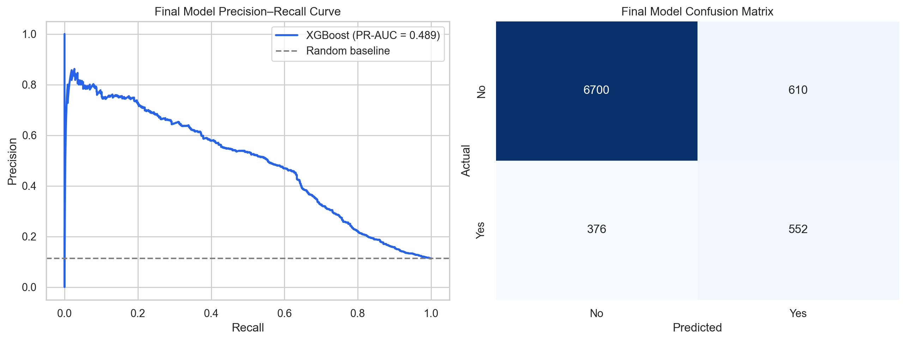
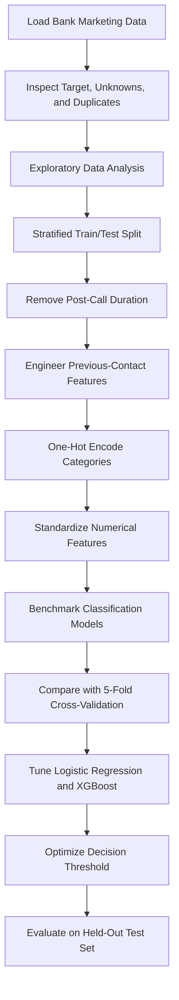

# Bank Marketing Subscription Prediction

<p align="center">
  
</p>

<p align="center">
  
  
  
  
</p>

An end-to-end imbalanced-classification study predicting whether a customer will subscribe to a term deposit following a Portuguese bank's direct-marketing campaign.

The project emphasizes leakage-aware feature selection, meaningful treatment of sentinel values, imbalance-sensitive evaluation, cross-validated model selection, and decision-threshold optimization.

## Results at a Glance

| Best model | ROC-AUC | PR-AUC | Subscriber precision | Subscriber recall | Subscriber F1 |
|---|---:|---:|---:|---:|---:|
| **Tuned XGBoost** | **0.816** | **0.489** | **0.48** | **0.59** | **0.53** |

The final model correctly identified **552 of 928 subscribers**. Threshold optimization nearly doubled subscriber recall relative to the untuned XGBoost model at the default 0.5 threshold.

## Project Overview

Bank marketing response prediction is an imbalanced classification problem: only **11.27%** of the 41,188 customers subscribed. A model predicting `no` for every customer would already achieve approximately 88.7% accuracy while finding no subscribers.

For that reason, this project evaluates models using precision, recall, F1, ROC-AUC, and especially PR-AUC rather than selecting a model by accuracy alone. The final model is designed for pre-call targeting, so `duration` is excluded because it is unavailable until a marketing call has ended.

## Workflow



## Dataset

The project uses `bank-additional-full.csv` from the [UCI Bank Marketing dataset](https://archive.ics.uci.edu/dataset/222/bank+marketing).

- 41,188 customer and campaign records
- 20 original input features
- Numerical and categorical predictors
- Binary target: term-deposit subscription (`yes` or `no`)
- Subscriber prevalence: 11.27%

The raw dataset is intentionally excluded from version control. Download it from UCI and place it at:

```text
data/bank-additional-full.csv
```

See [`data/README.md`](data/README.md) for detailed setup instructions.

## Feature-Engineering Decisions

- **`duration` removed:** call duration is known only after the call ends and is unavailable during pre-call customer selection.
- **`pdays = 999` decomposed:** the sentinel is replaced with `previously_contacted` and `days_since_previous_contact`.
- **`"unknown"` retained:** unavailable categorical values remain explicit categories rather than being replaced with guessed values.
- **Categorical features one-hot encoded:** arbitrary ordinal numbers are not imposed on unordered categories.
- **Numerical features standardized:** scaling parameters are learned from training data only.

## Models Compared

- **Dummy Classifier:** majority-class reference baseline
- **Logistic Regression:** regularized linear classification benchmark
- **Balanced Logistic Regression:** increased minority-class weighting
- **Decision Tree:** nonlinear single-tree model
- **Random Forest:** bagged tree ensemble
- **XGBoost:** sequential gradient-boosted tree ensemble

## Cross-Validation Results

| Model | CV precision | CV recall | CV F1 | CV ROC-AUC | CV PR-AUC |
|---|---:|---:|---:|---:|---:|
| Logistic Regression | 0.658 | 0.230 | 0.340 | 0.789 | **0.449** |
| Balanced Logistic Regression | 0.350 | **0.622** | **0.448** | **0.790** | 0.444 |
| XGBoost | 0.590 | 0.280 | 0.380 | 0.780 | 0.433 |
| Random Forest | 0.543 | 0.278 | 0.367 | 0.773 | 0.415 |
| Decision Tree | 0.311 | 0.337 | 0.323 | 0.622 | 0.181 |
| Dummy Classifier | 0.000 | 0.000 | 0.000 | 0.500 | 0.113 |

Logistic Regression was the strongest and most stable initial model family. Logistic Regression and XGBoost were selected for tuning because they offered the best combination of PR-AUC, generalization, and complementary linear and nonlinear behaviour.

## Hyperparameter Tuning

Grid search selected the following XGBoost configuration:

```text
colsample_bytree = 0.8
learning_rate = 0.03
max_depth = 5
min_child_weight = 5
n_estimators = 150
scale_pos_weight = 1
subsample = 0.8
```

Tuned XGBoost achieved a cross-validated PR-AUC of **0.470**, outperforming tuned Logistic Regression at **0.449**.

## Final Results

| Metric | Final holdout result |
|---|---:|
| Accuracy | 0.88 |
| ROC-AUC | 0.816 |
| PR-AUC | 0.489 |
| Subscriber precision | 0.48 |
| Subscriber recall | 0.59 |
| Subscriber F1 | 0.53 |
| Subscribers correctly identified | 552 / 928 |
| Subscribers missed | 376 |
| Non-subscribers incorrectly flagged | 610 |

The selected threshold intentionally accepts additional false-positive contacts in exchange for identifying substantially more genuine subscribers. A production threshold should ultimately be based on the bank's actual contact cost and expected value per subscription.

## Visual Analysis

### Precision-Recall Curve and Confusion Matrix

The precision-recall curve summarizes performance across classification thresholds, while the confusion matrix shows the final operating point selected using out-of-fold training predictions.


## Key Findings

- Previous campaign success is strongly associated with current subscription.
- Students and retired customers have the highest job-level subscription rates.
- Cellular contact is associated with a higher conversion rate than telephone contact.
- March, December, September, and October show high conversion rates but have smaller campaign volumes.
- Economic indicators such as `emp.var.rate`, `euribor3m`, and `nr.employed` are strongly correlated.
- Call duration is highly predictive but unsuitable for deployable pre-call targeting.
- Threshold optimization materially improves subscriber recall and F1 compared with the default 0.5 threshold.
- Accuracy alone obscures performance on the minority subscriber class.

## Repository Structure

```text
bank-marketing-classification/
|-- bank_marketing_classification.ipynb
|-- README.md
|-- requirements.txt
|-- .gitignore
|-- LICENSE
|-- assets/
|   `-- final_model_performance.png
`-- data/
    `-- README.md
```

## Running the Project

### 1. Clone the repository

```bash
git clone https://github.com/shlokdinesharora/bank-marketing-classification.git
```

### 2. Enter the project directory

```bash
cd bank-marketing-classification
```

### 3. Create a virtual environment

```bash
python -m venv .venv
```

### 4. Activate the environment

On Windows:

```powershell
.venv\Scripts\activate
```

On macOS or Linux:

```bash
source .venv/bin/activate
```

### 5. Install the dependencies

```bash
pip install -r requirements.txt
```

### 6. Download the dataset

Download `bank-additional-full.csv` from the [UCI Bank Marketing dataset](https://archive.ics.uci.edu/dataset/222/bank+marketing).

Place the extracted CSV at:

```text
data/bank-additional-full.csv
```

### 7. Start Jupyter Notebook

```bash
jupyter notebook
```

### 8. Run the analysis

Open `bank_marketing_classification.ipynb`, restart the kernel, and run all cells in order.

The notebook reads the dataset using the relative path `data/bank-additional-full.csv`.

> The XGBoost grid search evaluates hundreds of model configurations and may take several minutes depending on available hardware.

## Technologies Used

1. Python
2. scikit-learn
3. XGBoost
4. pandas
5. NumPy
6. Matplotlib
7. Seaborn
8. Jupyter Notebook

## Limitations and Future Improvements

- Consolidate preprocessing and estimation into complete scikit-learn pipelines.
- Use nested or repeated cross-validation for more robust model comparison.
- Select the production threshold using explicit campaign costs and expected subscription value.
- Add probability calibration and calibration diagnostics.
- Investigate feature effects using SHAP or permutation importance.
- Evaluate fairness across relevant customer groups.
- Monitor data and performance drift across future campaigns.

## License

This project is available under the MIT License.

Copyright (c) 2026 Shlok Arora
